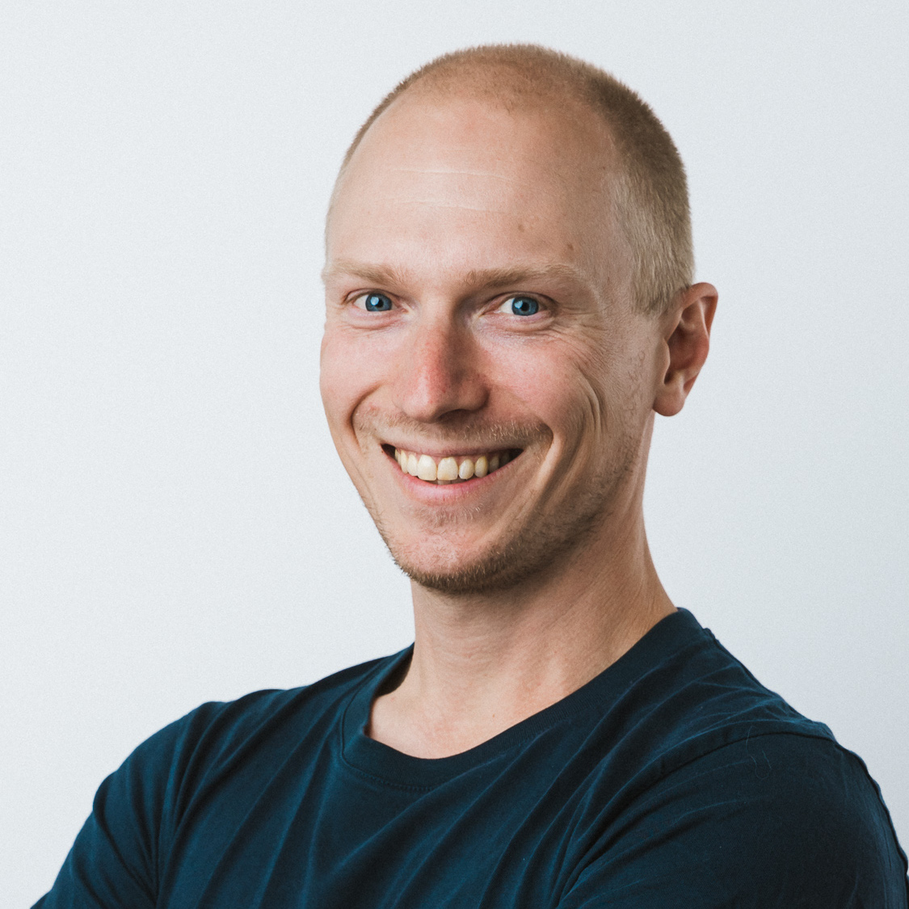

# Marcus Hellberg public speaking

Passionate about both learning and teaching, I help developers learn the skills they need for modern full-stack web development. My talks often explore the integration of Java with frontend technologies and delve into how developers can make the most of AI tools within their applications. My teaching approach is hands-on, emphasizing practical coding examples.

Beyond technical topics, I bring years of experience in Developer Relations to discuss how a strong DevRel strategy can create value for both developers and businesses.

## Want to collaborate or invite me to your event?

If you're interested collaborating on content or having me speak at your event, please to reach out to me on GitHub, Twitter, or LinkedIn and let's get the conversation started!

## Social media

- [Twitter](https://twitter.com/marcushellberg)
- [LinkedIn](https://www.linkedin.com/in/marcushellberg)

## Current talks

- [Java meets TypeScript: full-stack web apps with Spring Boot and React](abstracts/full-stack-spring-boot-react.md)
- [Unleashing AI in Java: A Guide to Semantic Kernel, LangChain4j, and Spring AI](abstracts/unleashing-ai-in-java.md) (🏆 [voted 3rd best talk at Jfokus 2024](https://www.linkedin.com/feed/update/urn:li:activity:7166054232050151427/))
- [Retrieval-augmented generation (RAG) with Spring Boot, React, and LangChain4j](abstracts/custom-ai-chatbot.md)
- [Full-stack web apps, 100% Java](abstracts/full-stack-web-100-percent-java.md)

| Bio                                                                                                                                                                                                                        | Headshot                         |
| -------------------------------------------------------------------------------------------------------------------------------------------------------------------------------------------------------------------------- | -------------------------------- |
| Marcus has spent the past 20 years combining modern web technologies and Java. He's always curious to learn new things and loves helping developers learn new things. He works as the VP of Developer Relations at Vaadin. |  |

## Online content

You can find many of my videos on the [Vaadin YouTube channel](https://www.youtube.com/vaadinofficial).

## Speaking engagements

| Date       | Event                                                    | Location             |
| ---------- | -------------------------------------------------------- | -------------------- |
| 2024-10-01 | dev2next                                                 | Lone Tree, CO        |
| 2024-05-15 | JCON Europe                                              | Cologne, Germany     |
| 2024-05-07 | Portland JUG                                             | Portland, OR         |
| 2024-05-01 | San Francisco JUG                                        | San Francisco, CA    |
| 2024-04-25 | Toronto JUG                                              | Toronto, ON, CA      |
| 2024-04-24 | Ottawa JUG                                               | Ottawa, ON, CA       |
| 2024-04-23 | Montreal JUG                                             | Montreal, QC, CA     |
| 2024-04-22 | Quebec City JUG                                          | Quebec City, QC, CA  |
| 2024-04-10 | DevNexus                                                 | Atlanta, GA          |
| 2024-03-28 | Kansas City JUG                                          | Kansas City, MO      |   
| 2024-03-27 | Chicago JUG                                              | Chicago, IL          |
| 2024-03-13 | Latam JUG                                                | Online               |
| 2024-02-07 | Jfokus                                                   | Stockholm, Sweden    |
| 2023-01-31 | JUG Oberpfaltz                                           | Weiden, Germany      |
| 2023-10-25 | Vaadin Create                                            | Frankfurt, Germany   |
| 2023-09-19 | Seattle JUG                                              | Seattle, WA          |
| 2023-07-12 | Webinar: Building a custom ChatGPT assistant             | Online               |
| 2023-06-20 | JCON                                                     | Cologne, Germany     |
| 2023-06-13 | Silicon Valley GDG                                       | Mountain View, CA    |
| 2023-05-10 | Charlotte JUG                                            | Charlotte, NC        |
| 2023-05-09 | Boston Java Meetup                                       | Boston, MA           |
| 2023-04-17 | Triangle JUG                                             | Raleigh, NC          |
| 2023-04-04 | DevNexus                                                 | Atlanta, GA          |
| 2023-01-31 | Webinar: Building streaming apps with Hilla and DataStax | Online               |
| 2023-01-19 | Utah JUG                                                 | Salt Lake City, UT   |
| 2023-01-11 | Denver JUG                                               | Denver, CO           |
| 2023-01-10 | Boulder JUG                                              | Boulder, CO          |
| 2022-10-18 | Oracle JavaOne                                           | Las Vegas, NV        |
| 2022-09-27 | JConf.dev                                                | Chicago, IL          |
| 2022-09-22 | San Francisco JUG                                        | San Francisco, CA    |
| 2022-09-15 | Vaadin Meetup                                            | Berlin, Germany      |
| 2022-05-12 | Devoxx UK                                                | London, UK           |
| 2022-02-06 | FOSDEM                                                   | Online               |
| 2021-10-07 | JCON online                                              | Online               |
| 2021-06-23 | Simple Web Conf                                          | Online               |
| 2021-04-14 | Philly JUG                                               | Online               |
| 2021-02-17 | DevNexus                                                 | Online               |
| 2020-02-20 | DevNexus                                                 | Atlanta, GA          |
| 2020-10-17 | Connect.tech                                             | Atlanta, GA          |
| 2019-10-14 | All Things Open                                          | Raleigh, NC          |
| 2019-04-11 | St. Louis JUG                                            | St. Louis, MO        |
| 2019-03-21 | Utah JUG                                                 | Salt Lake City, UT   |
| 2019-03-19 | Charlotte JUG                                            | Charlotte, NC        |
| 2019-03-18 | Triangle JUG                                             | Raleigh, NC          |
| 2019-03-07 | DevNexus                                                 | Atlanta, GA          |
| 2019-03-05 | Vaadin DevDay                                            | Houston, TX          |
| 2018-11-29 | Toronto JUG                                              | Toronto, ON, Canada  |
| 2018-10-23 | Oracle Code One                                          | San Francisco, CA    |
| 2018-10-17 | Connect.tech                                             | Atlanta, GA          |
| 2018-10-13 | Silicon Valley Code Camp                                 | San Jose, CA         |
| 2018-10-09 | Modern Web Bay Area Meetup                               | Mountain View, CA    |
| 2018-10-03 | San Francisco JUG                                        | San Francisco, CA    |
| 2018-10-02 | Detroit JUG                                              | Detroit, MI          |
| 2018-09-12 | Denver JUG                                               | Denver, CO           |
| 2018-09-11 | Boulder JUG                                              | Boulder, CO          |
| 2018-09-06 | Houston JUG                                              | Houston, TX          |
| 2018-09-04 | Nashville JUG                                            | Nashville, TN        |
| 2018-08-07 | Chicago JUG                                              | Chicago, IL          |
| 2018-07-19 | Modern Web Raleigh Meetup                                | Raleigh, NC          |
| 2018-07-17 | Seattle JUG                                              | Seattle, WA          |
| 2018-07-11 | Boston Java Meetup                                       | Boston, MA           |
| 2018-05-30 | Virtual JUG                                              | Online               |
| 2018-05-17 | Charleston JS                                            | Charleston, SC       |
| 2018-05-16 | Open Source 101                                          | Columbia, SC         |
| 2018-02-22 | DevNexus                                                 | Atlanta, GA          |
| 2017-10-03 | Oracle JavaOne                                           | San Francisco, CA    |
| 2017-09-21 | Connect.tech                                             | Atlanta, GA          |
| 2017-08-09 | Charlotte JUG                                            | Charlotte, NC        |
| 2017-05-11 | St. Louis JUG                                            | St. Louis, MO        |
| 2017-05-10 | Denver JUG                                               | Denver, CO           |
| 2017-05-09 | Boulder JUG                                              | Boulder, CO          |
| 2017-05-08 | Colorado Springs Open Source Meetup                      | Colorado Springs, CO |
| 2017-04-17 | Triangle JUG                                             | Raleigh, NC          |
| 2017-04-13 | Montreal JUG                                             | Montreal, QC, CA     |
| 2017-03-29 | Detroit JUG                                              | Detroit, MI          |
| 2017-05-07 | Nashville JUG                                            | Nashville, TN        |
| 2016-12-01 | Vaadin DevDay                                            | Raleigh, NC          |
| 2016-11-15 | Portland JUG                                             | Portland, OR         |
| 2016-10-18 | Google Polymer Summit                                    | London, UK           |
| 2016-09-20 | Oracle JavaOne                                           | San Francisco, CA    |
| 2016-04-12 | Web Components London                                    | London, UK           |
| 2016-02-16 | DevNexus                                                 | Atlanta, GA          |
| 2015-12-10 | Vaadin Meetup                                            | Washington, DC       |
| 2015-11-29 | Oracle JavaOne                                           | San Francisco, CA    |
| 2015-05-14 | New England JUG                                          | Boston, MA           |
| 2015-05-12 | Vaadin Meetup                                            | Montreal, QC, CA     |
| 2015-04-15 | Vaadin Meetup                                            | San Jose, CA         |
| 2015-03-17 | Vaadin Meetup                                            | New York, NY         |
| 2015-03-11 | DevNexus                                                 | Atlanta, GA          |
| 2014-12-09 | Vaadin Meetup                                            | Montreal, QC, CA     |
| 2014-12-13 | Vaadin Meetup                                            | Washington, DC       |
| 2014-10-28 | Austin JUG                                               | Austin, TX           |
| 2014-10-08 | Vaadin Meetup                                            | Boston, MA           |
